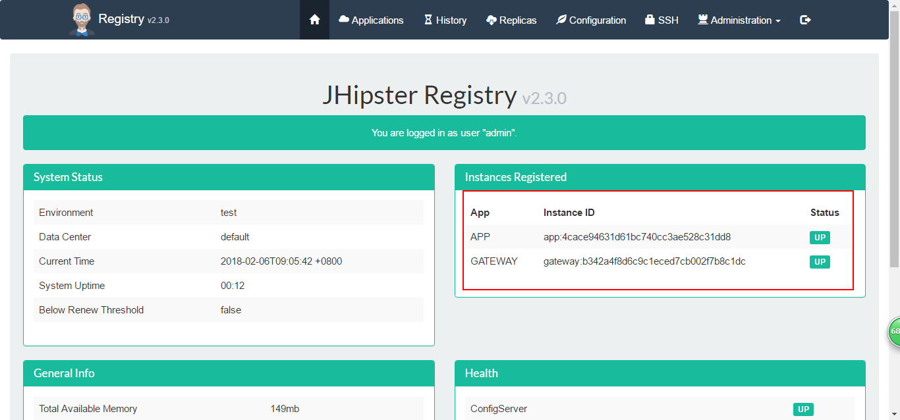

## 搭建微服务

### 搭建服务
#### 1. 编写服务
在jhipster生成的微服务中按照controller以及service服务开发程序，例如在rest包下编写controller类

按照以往的开发方式即可。

#### 2. 注册服务
启动该微服务，注册到注册中心，可以按照不同端口号启动多个实例，启动顺序依然是：
注册中心registry -> UAA -> 网关服务 -> 微服务。
启动后可以在注册中心看到注册的服务

#### 3. 访问服务
全部启动后可以在注册中心以及网关路由那里看到所有的服务

访问微服务时，需要在URI前加上服务的映射路径，我们部署的微服务映射路径为/app/**，所以我们访问我们的微服务时路径为下图

### spring cloud
#### 1. 介绍
jhipster 的微服务集成的是spring cloud，jhipster-registry就是我们的 eureka server，提供注册服务，各个服务的节点启动以后，会在eureka上进行注册，这样Eureka Server中就有了所有服务节点的信息。Eureka一般配合Ribbon进行使用，Ribbon提供了客户端负载均衡的功能，Ribbon利用从Eureka中读取到的服务信息，在调用服务节点提供的服务时，会合理的进行负载。 
Eureka通过心跳检测、健康检查、客户端缓存等机制，保证了系统具有高可用和灵活性。

### 异常处理
#### 1. 访问异常
**描述：** 访问网关时显示为空白页面
**解决：** 原因是启动顺序错误，按照 registry - UAA -gateway网关 - 微服务APP的顺序启动即可访问到网关的页面。

-------------------------------------------------
参考文章：
1. [jhipster 实体类生成以及服务间调度](https://hollycrm-td.github.io/docs/jhipster/jhipster-entity.html)
2. [SpringCloud服务发现（Eureka）简介](http://blog.csdn.net/haiyan_qi/article/details/52608586)