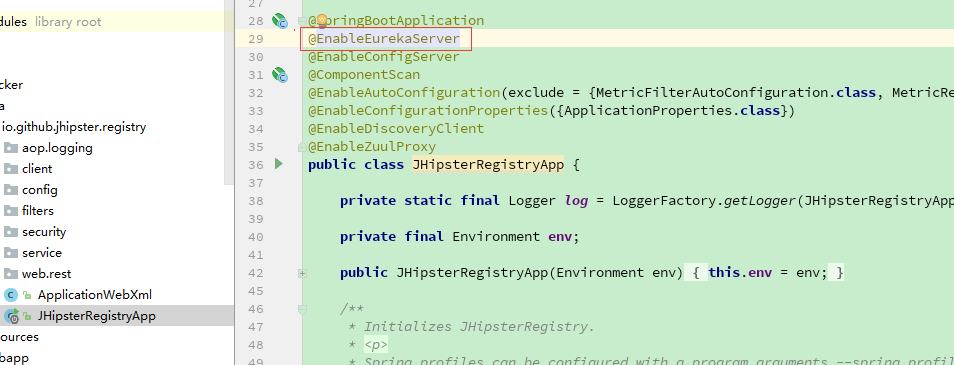

# 微服务架构

## 微服务注册与发现
 微服务架构中，服务发选择用画笔数非常关键的组件，服务消费者需要一个欠打的服务发现机制，用来获取服务提供者的网络信息。
 
 Spring cloud 提供了多种服务发现组件，Eureka、consul、Zookeeper等，这里我们主要使用eureka。
 
Eureka 是Netflix开源的服务发现组件，基于REST的服务。主要包含了Server和Client两个部分。

Eureka server：提供服务发现能力，各个微服务启动时会想server注册自己的信息，如IP、端口、服务名称等，并会周期性发送自己的心跳默认30秒，如果server在一定时间内没有接受到心跳，则会注销这个服务，多个server质检通过复制的方式来实心注册表中的数据同步。

Eureka client：是java客服端，会缓存服务注册表中的信息。会降低server的压力，当server宕机是，消费者可以从缓存中获取信息找到服务的提供者。

创建Eureka项目时：
1. 需要添加Erueka依赖

```xml
 <dependency>
            <groupId>org.springframework.cloud</groupId>
            <artifactId>spring-cloud-starter-eureka-server</artifactId>
        </dependency>
```

2. 在服务的启动类上添加注解@EnableEurekaServer，来声明这个服务是Eureka Server。



*****
参考书籍
1.《Spring Cloud 与Docker微服务架构实战》


