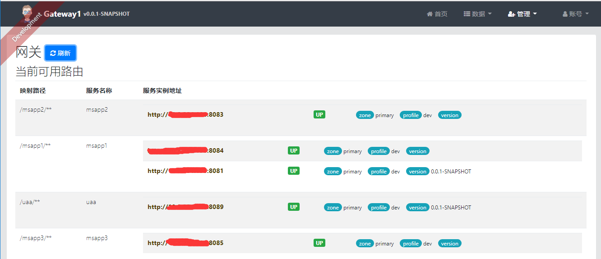

# 微服务之间调度

在上一篇笔记[jhipster 实体类生成以及服务间调度](./docs/jhipster/jhipster-entity.md)中我们大致介绍了如何通过网关调用服务。并创建了3个微服务应用。  

`说明：注册中心要先运行，负责其他的服务无法注册到祖册中心导致运行失败，然后再运行UAA，如果UAA没有运行，则网关服务无法启动，然后是其他的微服务应用。`  

这里我们设定，用msapp3 来调用msqpp1和msapp2的服务。这里我们重新来定义一下三个服务的应用例子。

1. msapp1服务（端口号：8081、8084）
创建一个controller，简单的打印一下服务名称和端口。

```java

package com.hollycrm.web.rest;

/**
 * Created by qianxm on 2018/2/8.
 */
@RestController
@RequestMapping("/app1")
public class AppExmpleResource {
    @Value("${server.port}")
    String port;
    @RequestMapping("/hi")
    public String home(@RequestParam String name) {
        return "hi "+name+",i am from port:" +port;
    }
}

```

2. msapp2 服务（端口号：8083）
 与msapp1 一样创建一个controller。

```java
package com.hollycrm.web.rest;

/**
 * Created by qianxm on 2018/2/8.
 */
@RestController
@RequestMapping("/app2")
public class AppExmpleResource {
    @Value("${server.port}")
    String port;
    @RequestMapping("/hi")
    public String home(@RequestParam String name) {
        return "hi "+name+",i am from port:" +port;
    }
}
```

3. msapp3服务（端口号：8085）
- 在程序的启动类ServiceFeignApplication ，加上@EnableFeignClients注解开启Feign的功能。

- 创建一fegin接口,通过注解@FeignClient(value = "服务名称")来指定调用那个服务

```java
# 在com.hollycrm.client包下创建两个接口用来指定调用msapp1和msapp2 服务

package com.hollycrm.client;

/**
 * Created by qianxm on 2018/2/9.
 * 调用服务msapp1
 */
@FeignClient(value = "msapp1")
public interface Msapp1FeignClient {
    @RequestMapping(value = "/app1/hi",method = RequestMethod.GET)
    String sayHiFromClientOne(@RequestParam(value = "name") String name);
}
============================================================================
/**
 * Created by qianxm on 2018/2/9.
 * 调用服务msapp2，@RequestMapping中value的值是具体的接口
 */
@FeignClient(value = "msapp2")
public interface Msapp2FeignClient {
    @RequestMapping(value = "/app2/hi",method = RequestMethod.GET)
    String sayHiFromClientTwo(@RequestParam(value = "name") String name);
}
```

- 创建web层的controller，向外暴露接口/app1/hi和/app2/hi

```java
# 在中创建com.hollycrm.web.rest，controller，根据暴露出来的接口来访问对应服务的接口
/**
 * Created by qianxm on 2018/2/9.
 * @author qianxm
 */
@RestController
@RequestMapping(name = "exmple")
public class ExmpleResource {

    /**
     * msapp1.
     */
    @Autowired
    private Msapp1FeignClient msapp1;

    @Autowired
    private Msapp2FeignClient msapp2;
    /**
     * 调用msapp1.
     * @param name 应用名称
     * @return 返回结果
     */
    @RequestMapping(value = "/app1/hi",method = RequestMethod.GET)
    public String sayHiOne(@RequestParam String name){
        return msapp1.sayHiFromClientOne(name);
    }

    @RequestMapping(value = "/app2/hi",method = RequestMethod.GET)
    public String sayHiTwo(final String name) {
        return msapp2.sayHiFromClientTwo(name);
    }

}

```


 然后分别启动三个应用，这里不分先后顺序，我们可以在网管中看到具体的情况

  

然后访问localhost:8085/app1/hi?name=msapp1

```
# 首次访问的结果是：

hi msapp1,i am from port:8081

# 刷新之后的结果：
hi msapp1,i am from port:8084


```
重复刷新，发现每次刷新后端口号都是改变的，三个服务都整合了ribbon，默认开启了负载均衡。然后访问localhost:8085/app2/hi?name=msapp2

```
hi msapp2,i am from port:8083
```


`注意：@RequestMapping中value的值是具体的接口名称，这里的名称需要跟具体的服务中声明的名称一致，否则无法调用正确的方法。controller中的接口路径也要一致`

*****

参考文档
1. [spring clound参考资料](http://blog.csdn.net/forezp/article/details/70148833)


