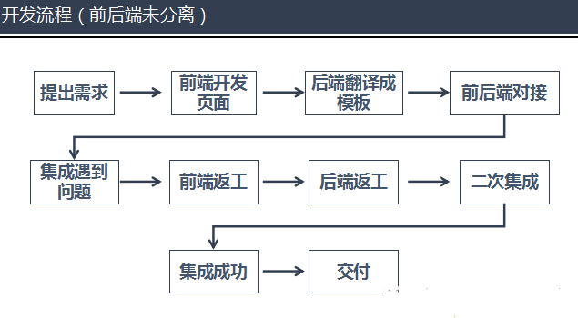
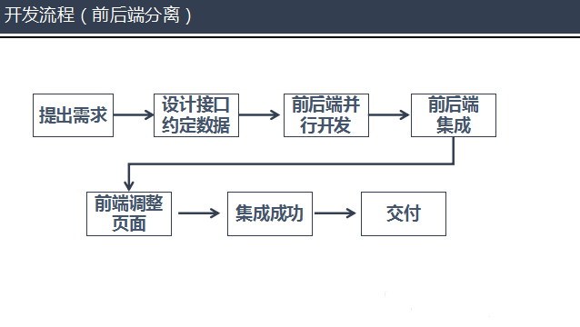
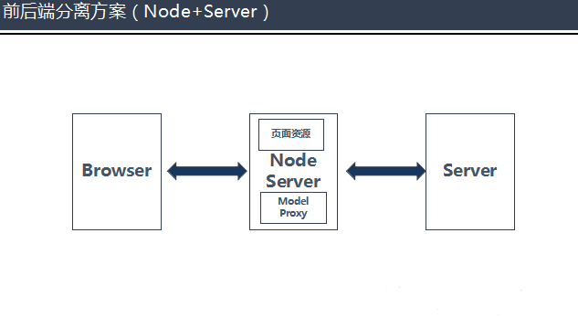

## 前后端分离

### 1. 概念
前端：在浏览器中进行数据展示，几乎不进行业务处理的代码为前端代码，用到的技术为前端技术。

后端：在服务器端进行大量业务处理，为前端提供数据准备的代码为后端代码，技术为后端技术。

前后端分离：前后端分离开发并不是简单意义上的人员分工问题，而是一种开发模式，由前端后端人员约定好数据交互接口后并行开发和测试，前后端使用http或其他协议进行交互，并对前后端应用进行分离式部署。

### 2. 前后端分离的好处
1. `提高效率`，前后端并行开发测试，效率会有提升。
2. `分工明确`，另外前端后端分离开发后，前端人不在需要关注后端代码，而后端人员也不需要维护前端代码。
3. `提高代码可读性`，代码整洁清晰，阅读维护都比较轻松。
4. `增强代码维护性`，前后端分离开来，只有运行时才存在调用关系，前后端代码不在混合在一起。
5. `应对前端变化`，一般情况下，项目多是前端页面变化，多要求绚丽丰富兼容，分离后可单独修改前端代码。

### 3. 应用场景
1. 前端页面频繁改动，而后端API很少改动的情况下，适合前后端分离开发。
2. 要求前端页面有好几套页面，要求跨设备兼容的情况下也适合前后端分离开发。
3. 前端后端隶属于不同部门，不能当面沟通的情况下。

### 4. 开发模式
当前后端未分离开发时，从需求到交付的开发流程大致如下图所示，如若联调遇到问题，那么必将是非常耗时费力的一件事。

当前后端分离开发时，如图可以看出与未分离开发的区别，便是前后端按照约定接口并行开发，提高了开发效率，同时在前后端集成联调阶段，也会很方便的为开发人员节省了时间。

### 5. 分离部署方案
网传的分离部署方案大部分都是通过node来部署前端页面，通过node来分发来自浏览器的请求。

因为node有解析渲染页面的功能，所以此做法在node接收到服务端的响应后可以将渲染好的页面返回给浏览器，所以还减轻了浏览器渲染页面的负担，但是所有响应都由node来渲染的话，node处理能力必将影响请求的响应效率。

具体如何使用node来实现前后端分离开发有待解决。

### 6. 分离代价
前后端分离开发，有优势，肯定也有劣势，优势很明显，前文已经提到过，劣势嘛其实也比较明显，便是学习成本的增加，如果是一些比较小的项目或者是轻前端的开发项目（前端页面比较单薄，没有华丽的样式，并且对于后续页面没有太多的变化），没有必要进行前后端分离开发，分离开发反而增加了维护成本。

### 7. 后话
曾经做过一个的项目，采用的是假的前后端分离开发模式，前期按照接口约定好后各自开发，可是到了联调测试阶段，不得已又将项目合并，为了配合前端测试，后端人员不得已还要在前端的电脑上安装上Java的开发环境，才能使前端人员测试接口，有时后端人员也要帮着前端人员在后台打断点来调试接口，分工并不明确，而且开发效率低。联调阶段甚是头疼，对于这种前后端混沌在一起开发来说，前后端联调确实是一件很麻烦的事情。

---------------------------------------------------------------

参考文章：
1. [前后端分离实践（一）](https://segmentfault.com/a/1190000009329474?_ea=2038402#articleHeader1)
2. [前后端分离，是为了彼此更好](https://www.jianshu.com/p/e7b8d0801707)